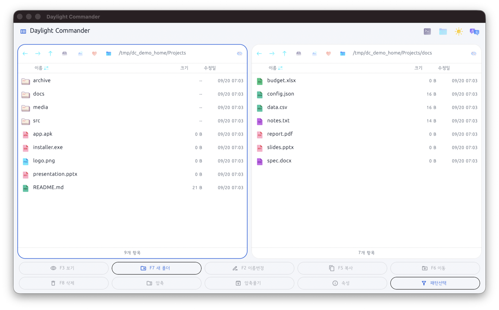
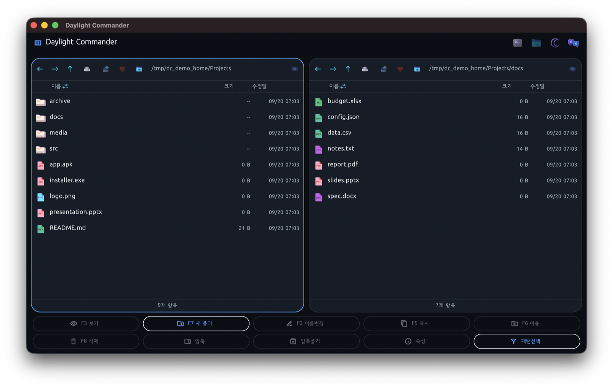

# Daylight Commander

[](https://github.com/jejezz/daylight-commander-flutter/releases/latest)
[](#supported-platforms)
[](https://flutter.dev)
[](LICENSE)

**English | [한국어](README.md)**

A **free, dual-pane desktop file manager** in the style of Total Commander /
Midnight Commander. Built with Flutter, it supports Windows, macOS, and Linux
(mobile is not a target).

It aims to be a classic file manager with fast keyboard-driven navigation,
SMB/FTP/SFTP/WebDAV network drives, built-in viewers, and folder comparison
and sync.

## Screenshots

|                                Light Theme                                |                                Dark Theme                                |
| :------------------------------------------------------------------------: | :------------------------------------------------------------------------: |
|  |  |

Notice the color-coded file type icons, each pane navigating an independent
path, and the theme/language toggle buttons in the app bar.

## Key Features

### Navigation & Selection
- **Dual-pane navigation**: back/forward/up, refresh (`Ctrl`/`Cmd`+`R`), direct
  address bar input, drive switching, click-to-sort columns (name/size/modified)
- **Multi-select**: mouse (click/Shift/Ctrl) and keyboard (arrow-key cursor +
  Space) both supported, select all, pattern-based (`*.jpg`) select/deselect
- **Quick search**: type while a pane is focused to instantly filter by name
- **Bookmarks & recent folders**: save frequently used paths and jump to them

### File Operations
- Copy/move (F5/F6, with skip/overwrite/rename/apply-to-all on conflict),
  delete (F8, trash or permanent), new folder (F7)/new file, rename (F2),
  progress display + cancel
- Compress/extract (zip) — also supports **browsing zip contents without
  extracting** (F3 / right-click "View")
- View and edit properties, including read-only/rwx permissions (`chmod` on
  macOS/Linux, `attrib` on Windows)
- Drag-and-drop between Finder/Explorer and the app; double-click opens files
  with the OS's default app

### Network Drives
- **SMB** (delegated to the OS mount dialog), **FTP**, **SFTP**, **WebDAV** —
  implemented with pure Dart clients
- Server profiles are saved (host/port/username only) — **passwords are never
  stored**

### Built-in Viewer (F3)
- Text, images, PDF, audio/video, hex dump
- Unsupported formats get an "Open with Default App" button

### Folder Comparison & Sync
- Compares both panes by filename and highlights differences
- **One-way sync**: bulk-copy differing items to the other pane
- **Two-way sync**: files that exist on only one side are copied
  automatically, and files that exist on both sides but differ are resolved
  one at a time by picking which version to keep

### Other Conveniences
- **Light/dark theme** toggle (can also follow the OS setting)
- **Localization (Korean/English)** — switch directly from the app bar
- Right-click context menu, open a terminal at the current folder, color
  icons per file type

## Supported Platforms

Windows · macOS · Linux

## Download & Install

Prebuilt binaries are available on the
[Releases page](https://github.com/jejezz/daylight-commander-flutter/releases/latest).

### macOS

1. Open `DaylightCommander-macos.dmg` and drag `Daylight Commander.app` into
   your Applications folder
2. **If you see a "damaged" or "unidentified developer" warning on first
   launch** — this build isn't notarized by Apple, so macOS automatically
   quarantines files downloaded from the internet. Run this in Terminal to
   fix it:

   ```bash
   xattr -cr "/Applications/Daylight Commander.app"
   ```

   Double-click the app again afterward and it will open normally.

### Windows

1. Run `DaylightCommander-Setup.exe` and follow the installer (creates a
   Start Menu shortcut; can be removed from "Apps & Features")
2. Since the installer isn't signed, SmartScreen may warn you — click
   "More info" → "Run anyway"

### Linux

1. Extract `DaylightCommander-linux.tar.gz` and run the executable inside

## Building from Source (for developers)

### Requirements

- Flutter SDK (`environment.sdk: ^3.13.1`, see `pubspec.yaml`)

### Install dependencies

```bash
flutter pub get
```

### Run

```bash
flutter run -d macos    # or -d windows, -d linux
```

### Release build

```bash
flutter build macos --release    # or windows/linux
```

See [`RELEASING.md`](RELEASING.md) for the full process of tagging a new
version and publishing a GitHub Release.

## Testing

```bash
flutter test
```

The FTP/SFTP/WebDAV clients are integration-tested against real local
servers. Since this app implements those protocols itself, mocks alone
weren't trustworthy enough. Integration tests run automatically if the
following Python packages are installed, and are skipped otherwise.

```bash
pip3 install --user pyftpdlib asyncssh wsgidav cheroot
```

## Project Documentation

- [`PLAN.md`](PLAN.md) — feature list, MVP priority (P0/P1/P2), progress
  (Korean)
- [`ARCHITECTURE.md`](ARCHITECTURE.md) — architecture design and key
  technical decisions (Korean)
- [`UI_UX.md`](UI_UX.md) — theme, icon system, component/shortcut guide
  (Korean)
- [`RELEASING.md`](RELEASING.md) — how to build installers and publish a
  GitHub Release (Korean)

## License

[MIT License](LICENSE) — Copyright © 2026 jyahn
